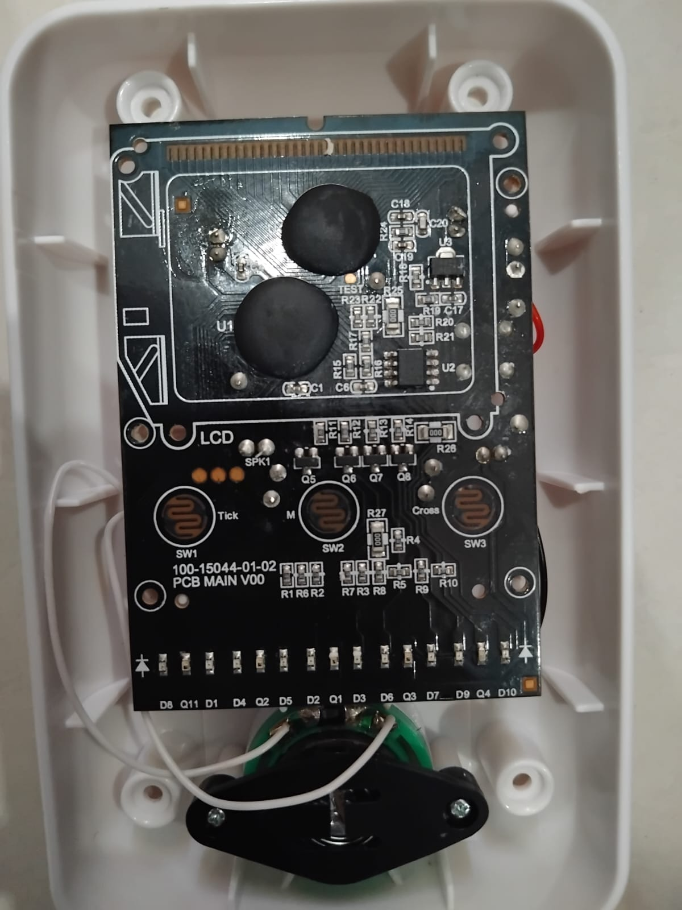
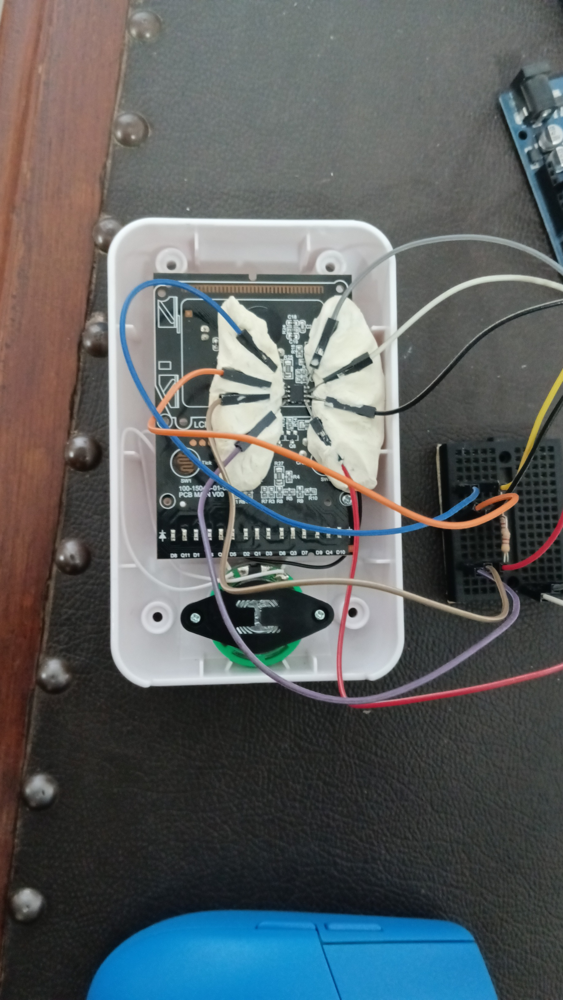

# Monopoly Ultimate Banking — Reverse Engineering Documentation

> A community reverse engineering project documenting the EEPROM memory layout and card barcode encoding of the Monopoly Ultimate Banking board game.

---

## 👥 Authors

- **Srikar B**
- **Shreyans Sahu**

---

## 📸 Photos

---

## 🔍 What We Found

We reverse engineered two things:

1. **EEPROM Memory Layout** — The game unit contains an AT24C02D EEPROM chip that stores property ownership and rent levels. We mapped out which bytes correspond to which properties.

2. **Card Barcode Encoding** — Each card has a barcode-style strip of 10 bars (black/white). We decoded the encoding scheme and catalogued every card's binary code.

---

## 📁 Documentation

| File | What's in it |
|------|-------------|
| [`eeprom/overview.md`](eeprom/overview.md) | The chip, how we accessed it, the Arduino setup |
| [`eeprom/memory-map.md`](eeprom/memory-map.md) | Properties byte map — what each byte means |
| [`eeprom/unknown-bytes.md`](eeprom/unknown-bytes.md) | Bytes we haven't decoded yet |
| [`barcode/format.md`](barcode/format.md) | How the barcode encoding works |
| [`barcode/card-list.md`](barcode/card-list.md) | Every card and its binary code |
| [`hardware/arduino-setup.md`](hardware/arduino-setup.md) | Wiring diagram and Arduino sketch |

---

## 🤝 Contributing

We've only decoded 22 of the 256 bytes. If you figure out more (especially where player balances are stored), please open an issue or a pull request!

---

## ⚠️ Disclaimer

This is an independent reverse engineering project for educational purposes. We are not affiliated with Hasbro or the Monopoly brand.
