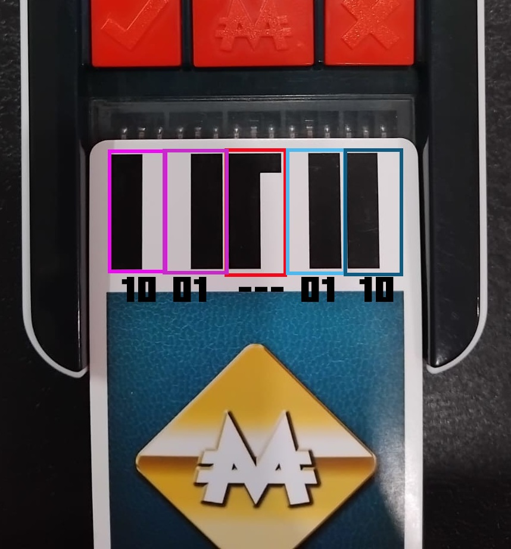

# Card Barcode — Encoding Format

Each Monopoly Ultimate Banking card has a strip on the back with **10 bars** (black or white). This is how the game unit identifies which card is being scanned.

---

## Physical Format

- **Total bars:** 10
- **White bar:** = `0`
- **Black bar:** = `1`
- **Parity bars:** The **middle 2 bars** (positions 5 and 6) are a parity check and are not part of the data
- **Data bars:** The remaining **8 bars** (positions 1–4 and 7–10) carry the actual card value



---

## Encoding Scheme

The 8 data bits form a binary number. However, not all 8-bit values are valid — the encoding uses a constraint to avoid certain patterns.

### The "No `11` Pair" Constraint

Split the 8-bit number into four 2-bit pairs:

```
Byte:  X X | X X | X X | X X
       pair1  pair2  pair3  pair4
```

A value is **valid** only if **none** of the four pairs equals `11` (binary).

This constraint allows 81 possible cards.

### Valid Property Code Range

Valid property codes run from `00010000` to `01000100`. Among all values in this range that pass the no-`11`-pair check, there are exactly **22** — these map to the 22 properties in order:

| Property # | Binary Code |
|-----------|------------|
| 1  | `00010000` |
| 2  | `00010001` |
| 3  | `00010010` |
| 4  | `00010100` |
| 5  | `00010101` |
| 6  | `00010110` |
| 7  | `00011000` |
| 8  | `00011001` |
| 9  | `00011010` |
| 10 | `00100000` |
| 11 | `00100001` |
| 12 | `00100010` |
| 13 | `00100100` |
| 14 | `00100101` |
| 15 | `00100110` |
| 16 | `00101000` |
| 17 | `00101001` |
| 18 | `00101010` |
| 19 | `01000000` |
| 20 | `01000001` |
| 21 | `01000010` |
| 22 | `01000100` |

### Full Validity Table

This table lists every binary number from `00010000` to `01000100` and whether it passes the constraint:

| Binary Number | Pairs | Valid? | Reason |
| :--- | :--- | :--- | :--- |
| `00010000` | 00 01 00 00 | ✅ | No `11` |
| `00010001` | 00 01 00 01 | ✅ | No `11` |
| `00010010` | 00 01 00 10 | ✅ | No `11` |
| `00010011` | 00 01 00 11 | ❌ | Contains `11` |
| `00010100` | 00 01 01 00 | ✅ | No `11` |
| `00010101` | 00 01 01 01 | ✅ | No `11` |
| `00010110` | 00 01 01 10 | ✅ | No `11` |
| `00010111` | 00 01 01 11 | ❌ | Contains `11` |
| `00011000` | 00 01 10 00 | ✅ | No `11` |
| `00011001` | 00 01 10 01 | ✅ | No `11` |
| `00011010` | 00 01 10 10 | ✅ | No `11` |
| `00011011` | 00 01 10 11 | ❌ | Contains `11` |
| `00011100` | 00 01 11 00 | ❌ | Contains `11` |
| `00011101` | 00 01 11 01 | ❌ | Contains `11` |
| `00011110` | 00 01 11 10 | ❌ | Contains `11` |
| `00011111` | 00 01 11 11 | ❌ | Contains `11` |
| `00100000` | 00 10 00 00 | ✅ | No `11` |
| `00100001` | 00 10 00 01 | ✅ | No `11` |
| `00100010` | 00 10 00 10 | ✅ | No `11` |
| `00100011` | 00 10 00 11 | ❌ | Contains `11` |
| `00100100` | 00 10 01 00 | ✅ | No `11` |
| `00100101` | 00 10 01 01 | ✅ | No `11` |
| `00100110` | 00 10 01 10 | ✅ | No `11` |
| `00100111` | 00 10 01 11 | ❌ | Contains `11` |
| `00101000` | 00 10 10 00 | ✅ | No `11` |
| `00101001` | 00 10 10 01 | ✅ | No `11` |
| `00101010` | 00 10 10 10 | ✅ | No `11` |
| `00101011` | 00 10 10 11 | ❌ | Contains `11` |
| `00101100` | 00 10 11 00 | ❌ | Contains `11` |
| `00101101` | 00 10 11 01 | ❌ | Contains `11` |
| `00101110` | 00 10 11 10 | ❌ | Contains `11` |
| `00101111` | 00 10 11 11 | ❌ | Contains `11` |
| `00110000` | 00 11 00 00 | ❌ | Contains `11` |
| `00110001` | 00 11 00 01 | ❌ | Contains `11` |
| `00110010` | 00 11 00 10 | ❌ | Contains `11` |
| `00110011` | 00 11 00 11 | ❌ | Contains `11` |
| `00110100` | 00 11 01 00 | ❌ | Contains `11` |
| `00110101` | 00 11 01 01 | ❌ | Contains `11` |
| `00110110` | 00 11 01 10 | ❌ | Contains `11` |
| `00110111` | 00 11 01 11 | ❌ | Contains `11` |
| `00111000` | 00 11 10 00 | ❌ | Contains `11` |
| `00111001` | 00 11 10 01 | ❌ | Contains `11` |
| `00111010` | 00 11 10 10 | ❌ | Contains `11` |
| `00111011` | 00 11 10 11 | ❌ | Contains `11` |
| `00111100` | 00 11 11 00 | ❌ | Contains `11` |
| `00111101` | 00 11 11 01 | ❌ | Contains `11` |
| `00111110` | 00 11 11 10 | ❌ | Contains `11` |
| `00111111` | 00 11 11 11 | ❌ | Contains `11` |
| `01000000` | 01 00 00 00 | ✅ | No `11` |
| `01000001` | 01 00 00 01 | ✅ | No `11` |
| `01000010` | 01 00 00 10 | ✅ | No `11` |
| `01000011` | 01 00 00 11 | ❌ | Contains `11` |
| `01000100` | 01 00 01 00 | ✅ | No `11` |

---

## How We Decoded This

Our decoding started with a Reddit thread on r/Decoders where someone had partially mapped the barcodes. One [comment](https://www.reddit.com/r/Decoders/comments/oihb0t/comment/hlgu2id/?utm_source=share&utm_medium=web3x&utm_name=web3xcss&utm_term=1&utm_content=share_button) in particular unlocked the structure for us.

---

## Notes

- The parity bits (positions 5–6) — depends on the card number, not the binary code. It alternates every card. The parity bits are never 00, either 01 or 10.