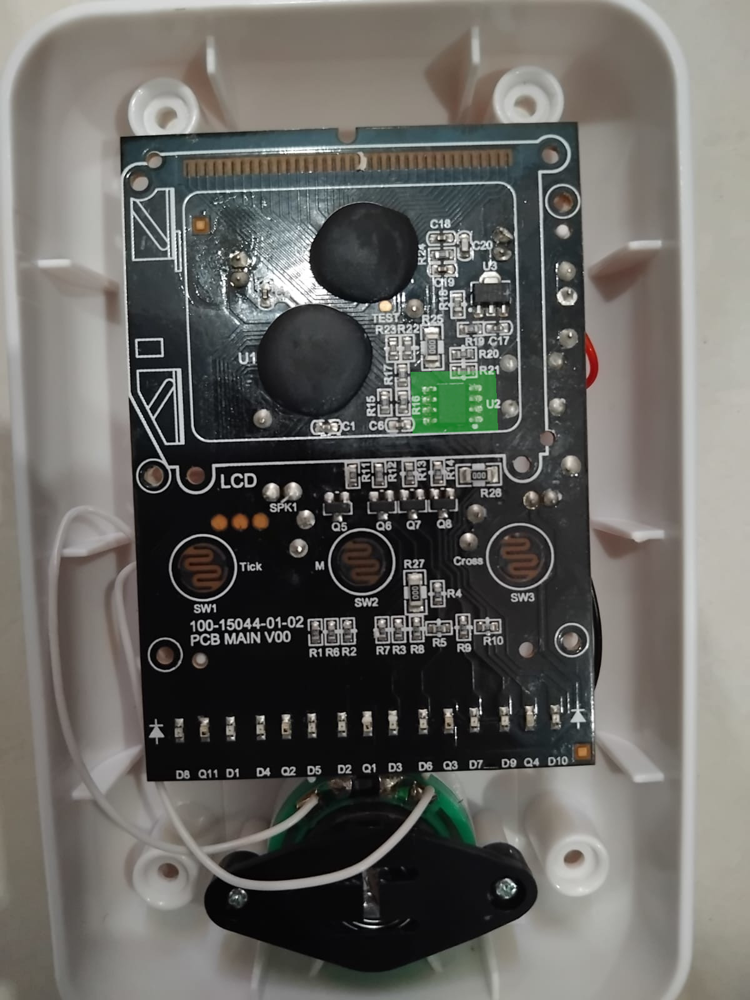

# EEPROM — Overview & Physical Access

## The Chip

- **Model:** AT24C02D
- **Capacity:** 256 bytes (2Kbit)
- **Interface:** I²C
- **Datasheet:** [AT24C02D Datasheet](https://www.microchip.com/en-us/product/at24c02d) *(external link)*

---

## How We Found It

When we opened the Monopoly Ultimate Banking unit, we found three components on the PCB. Two of them were covered in epoxy, making them inaccessible. The third — the AT24C02D EEPROM — was exposed.



---

## Physical Access

Since the chip was surface-mounted, we couldn't use a chip clip. Instead, we:

1. Pressed clay against the PCB and let it harden and used it to support the wires
2. Connected 8 wires to the EEPROM's pins
3. Routed them to a breadboard connected to an Arduino UNO


### Pin Connections

| AT24C02D Pin | Arduino UNO Pin |
|-------------|----------------|
| VCC & WP | 3.3V |
| GND | GND |
| SDA | SDA |
| SCL | SCL |
| A0, A1, A2 | GND (I²C address = 0x50) |

---

## Reading the EEPROM

We connected the pins to the arduino and used a cricuit similar to what was shown in the [website](https://microcontrollerslab.com/at24c02-two-wire-serial-eeprom-pinout-interfacing-with-arduino/).
Then we used this code to read it

```Arduino
#include <Wire.h>

// A2, A1, A0 are all grounded (000) -> I2C Address is 0x50
#define ADDR_Ax 0b000 
#define ADDR ((0b1010 << 3) + ADDR_Ax) 

void setup() {

  delay(3000);
  
  Serial.begin(9600);
  while (!Serial) {};
  Wire.begin();
  
  Serial.println("--- Starting EEPROM Full Memory Dump (256 Bytes) ---");
  Serial.println("Addr:  00 01 02 03 04 05 06 07 08 09 0A 0B 0C 0D 0E 0F");
  Serial.println("-----------------------------------------------------");

  for (int i = 0; i < 256; i++) {
    
    if (i % 16 == 0) {
      Serial.print("\n");
      if (i < 16) Serial.print("0");
      Serial.print(i, HEX);
      Serial.print(":  ");
    }
    
    byte data = readI2CByte(i);
    
    if (data < 16) {
      Serial.print("0");
    }
    Serial.print(data, HEX);
    Serial.print(" ");
    
    delay(5);
  }
  
  Serial.println("\n-----------------------------------------------------");
  Serial.println("--- Memory Dump Complete ---");
}

byte readI2CByte(byte data_addr){
  byte data = 106; // default
  
  Wire.beginTransmission(ADDR);
  Wire.write(data_addr);
  Wire.endTransmission();
  
  Wire.requestFrom(ADDR, 1);

  delay(2);
  
  if(Wire.available()){
    data = Wire.read();
  }
  return data;
}
```

---

## Raw Baseline Dump

This is the EEPROM contents at the start of a fresh game (no properties bought):

```
00:  05 30 9E 7F 32 BE B8 12 08 00 FF FF FF FF FF FF
10:  05 2F 89 74 2B AF A2 12 14 00 01 26 FF FF FF FF
20:  05 35 9B 7F 33 B5 B6 12 01 01 01 05 FF FF FF FF
30:  FF 36 8E 7C 37 AC A8 12 06 00 01 40 FF FF FF FF
40:  FF 30 8D 71 36 A3 A7 12 06 01 01 50 FF FF FF FF
50:  00 00 00 00 00 00 00 00 00 00 00 00 00 00 00 00
60:  00 00 00 00 00 00 00 00 00 00 00 00 00 00 00 00
70:  00 00 00 00 00 00 00 00 00 00 00 00 00 00 00 00
80:  FF FF FF FF FF FF FF FF FF FF FF FF FF FF FF FF
90:  FF FF FF FF FF FF FF FF FF FF FF FF FF FF FF FF
A0:  FF FF FF FF FF FF FF FF FF FF FF FF FF FF FF FF
B0:  FF FF FF FF FF FF FF FF FF FF FF FF FF FF FF FF
C0:  FF FF FF FF FF FF FF FF FF FF FF FF FF FF FF FF
D0:  FF FF FF FF FF FF FF FF FF FF FF FF FF FF FF FF
E0:  FF FF FF FF FF FF FF FF FF FF FF FF FF FF FF FF
F0:  FF FF FF FF FF FF FF FF FF FF FF FF FF FF FF FF
```

Key observations:
- Bytes `0x00–0x4F`: Partially unknown — some seem to relate to game state (rows 00–40)
- Bytes `0x50–0x7F`: **Property data region** — all zeros when no properties are bought
- Bytes `0x80–0xFF`: Always `FF` — likely unused or reserved
