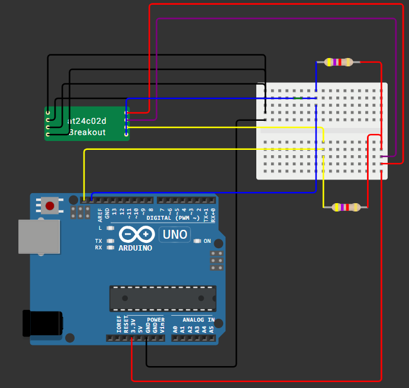
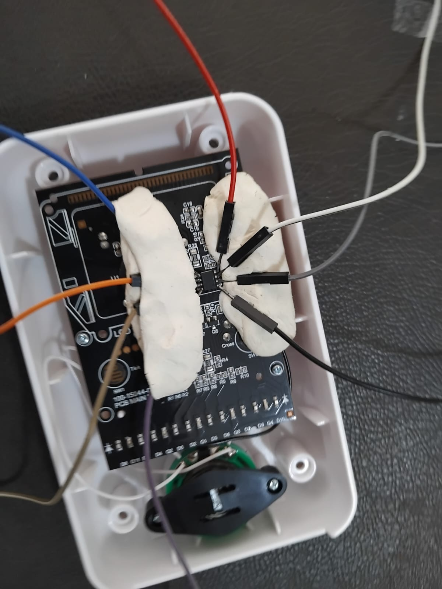

# Hardware Setup — Arduino EEPROM Reader

## Components Used

- Arduino UNO
- AT24C02D EEPROM (from the Monopoly unit)
- Breadboard
- Jumper wires (×8)
- Modelling clay (used to hold wires against EEPROM pins)

---

## Wiring

We based our wiring on a breadboard diagram found online for reading I²C EEPROMs with an Arduino.
[Website](https://microcontrollerslab.com/at24c02-two-wire-serial-eeprom-pinout-interfacing-with-arduino/)

### Connection Table

| AT24C02D Pin | Function | Arduino UNO |
|-------------|----------|-------------|
| Pin 1 (A0) | I²C Address bit 0 | GND |
| Pin 2 (A1) | I²C Address bit 1 | GND |
| Pin 3 (A2) | I²C Address bit 2 | GND |
| Pin 4 (GND) | Ground | GND |
| Pin 5 (SDA) | I²C Data | SDA |
| Pin 6 (SCL) | I²C Clock | SCL |
| Pin 7 (WP) | Write Protect | GND (disabled) |
| Pin 8 (VCC) | Power | 3.3V |

> With A0–A2 all tied to GND, the I²C address of the chip is **0x50**.

---

## The Tricky Part — Connecting to a Soldered Chip

Since the EEPROM was soldered to the PCB and not in a socket, we couldn't use a standard chip clip. Our method:

1. Pressed clay against the PCB and let it harden and used it to support the wires
2. Connected 8 wires to the EEPROM's pins
3. Routed them to a breadboard connected to an Arduino UNO

---

### How to Use

1. Wire up the Arduino as described above
2. Open the Arduino IDE and paste the code
3. Upload to your Arduino UNO
4. Open Serial Monitor
5. The 256-byte hex dump will print automatically

---